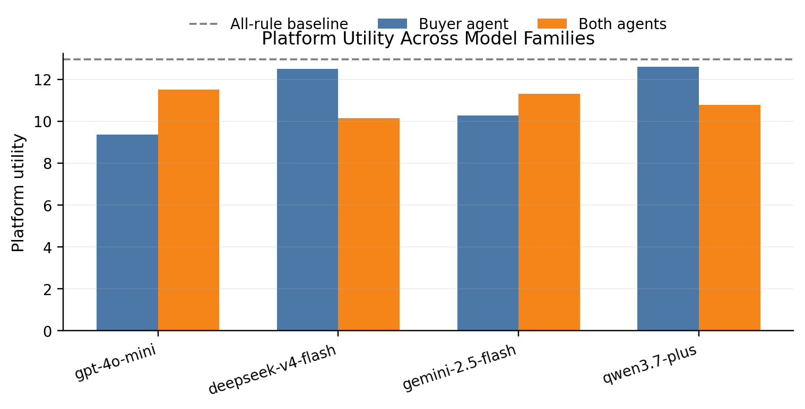
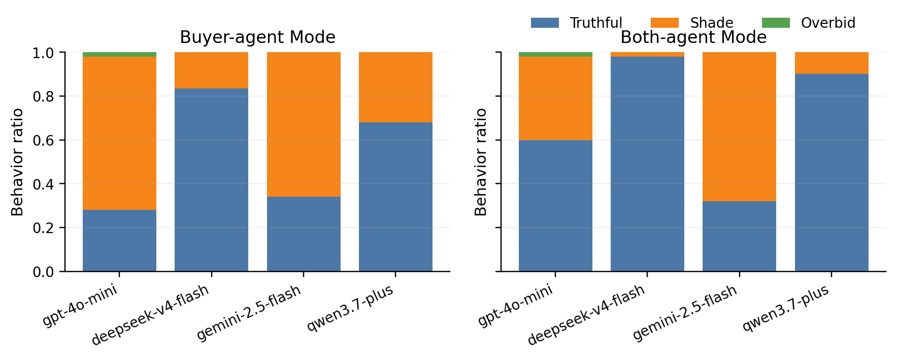
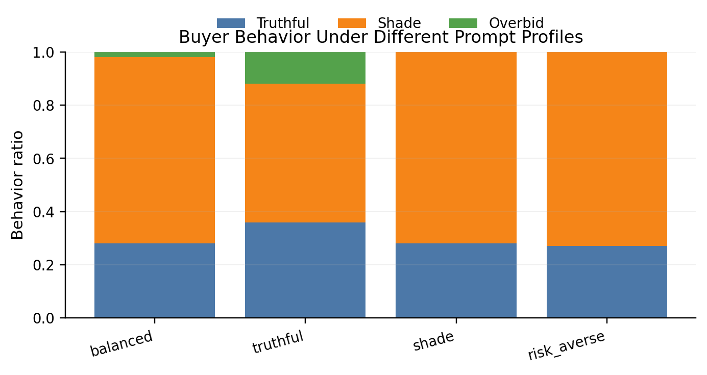
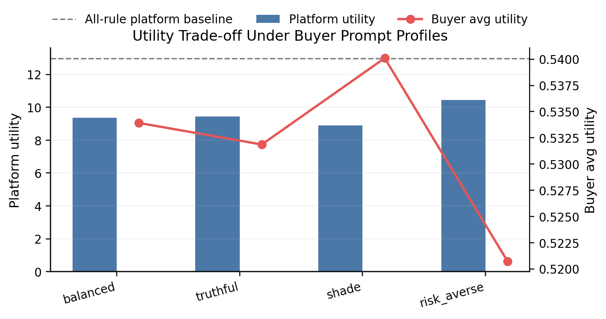
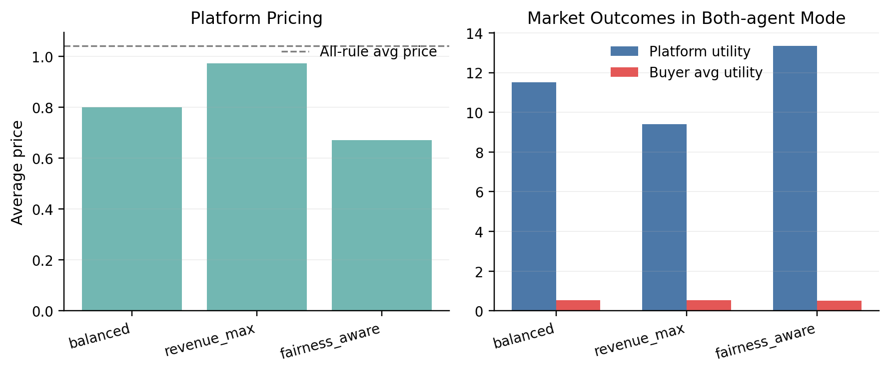
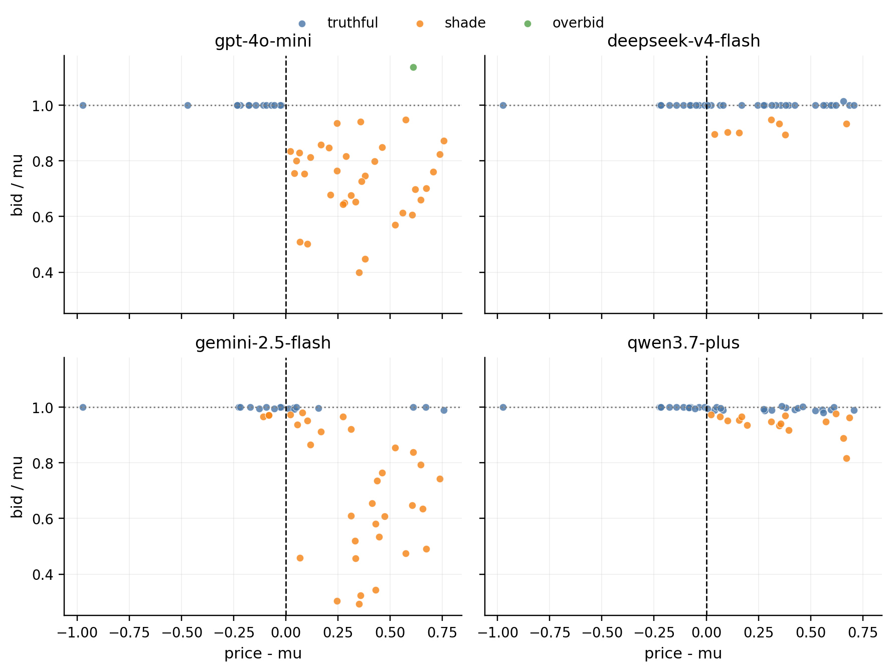

# 模型与 Profile 实验结果分析

本轮实验基于 50 轮交易，对模型切换与 Prompt Profile 切换两组实验进行比较。规则基准组 `all_rule` 在各组实验中保持一致：

| 指标 | 数值 |
|---|---:|
| 平台总效用 | 12.961 |
| 买家平均效用 | 0.475 |
| 平均价格 | 1.042 |
| 平均报价 | 0.835 |
| 平均数据增益 | 0.914 |
| 平均平台收入 | 0.306 |

## 结论一：不同模型家族会产生明显不同的市场行为

在相同 Prompt Profile、相同市场机制参数下，不同模型的 `buyer_agent` 和 `both_agent` 结果存在明显差异。

| 模型 | buyer_agent 平台效用 | buyer_agent 诚实率 | both_agent 平台效用 | both_agent 诚实率 |
|---|---:|---:|---:|---:|
| gpt-4o-mini | 9.367 | 28% | 11.499 | 60% |
| deepseek-v4-flash | 12.494 | 84% | 10.140 | 98% |
| gemini-2.5-flash | 10.280 | 34% | 11.302 | 32% |
| qwen3.7-plus | 12.587 | 68% | 10.776 | 90% |

从平台效用看，`deepseek-v4-flash` 和 `qwen3.7-plus` 在 `buyer_agent` 模式下更接近规则基准；`gpt-4o-mini` 和 `gemini-2.5-flash` 的平台效用损失更明显。

## 结论二：模型差异主要来自买家报价行为差异

模型之间的差异不是单纯的数值波动，而是体现在买家 Agent 的行为倾向上。`deepseek-v4-flash` 和 `qwen3.7-plus` 更倾向于接近诚实报价；`gemini-2.5-flash` 和 `gpt-4o-mini` 更容易出现低报。

在 `buyer_agent` 模式下：

| 模型 | 诚实报价 | 低报 | 平均 bid/mu |
|---|---:|---:|---:|
| gpt-4o-mini | 14/50 | 35/50 | 0.812 |
| deepseek-v4-flash | 42/50 | 8/50 | 0.983 |
| gemini-2.5-flash | 17/50 | 33/50 | 0.801 |
| qwen3.7-plus | 34/50 | 16/50 | 0.978 |

因此，模型选择会直接影响市场中的报价策略，进而影响平台收入和整体效用。

## 结论三：买家 Profile 能改变行为方向，但不能完全强制策略

买家侧 Profile 实验显示，`shade` 会显著增强低报倾向，`truthful` 能提高诚实率，但并不能完全恢复理论中的诚实报价。

| 买家 Profile | 平台效用 | 买家平均效用 | 诚实率 | 低报率 |
|---|---:|---:|---:|---:|
| balanced | 9.367 | 0.534 | 28% | 70% |
| truthful | 9.439 | 0.532 | 36% | 52% |
| shade | 8.891 | 0.540 | 28% | 72% |
| risk_averse | 10.442 | 0.521 | 28% | 72% |

这里的关键点是：`truthful` Profile 并不等同于规则买家。LLM 仍然会在价格高于自身估值时做策略性调整，说明 Prompt Profile 是软约束，而不是硬规则。

## 结论四：低报提高买家效用，但会压低平台收益

买家 Profile 实验体现了明显的收益转移：当买家更倾向低报时，买家平均效用上升，但平台效用下降。

例如，`shade` Profile 下：

| 指标 | balanced | shade |
|---|---:|---:|
| 平台效用 | 9.367 | 8.891 |
| 买家平均效用 | 0.534 | 0.540 |
| 平均 bid/mu | 0.812 | 0.759 |
| 低报率 | 70% | 72% |

这说明买家 Agent 的策略性报价并没有简单导致“市场整体更好”，而是改变了收益分配：买家侧收益提高，平台侧收益受损。

## 结论五：平台 Profile 通过价格改变双边交互结果

平台侧 Profile 主要影响定价路径。`revenue_max` 更接近高价策略，`fairness_aware` 明显降低价格。

在 `both_agent` 模式下：

| 平台 Profile | 平均价格 | 平台效用 | 买家平均效用 |
|---|---:|---:|---:|
| balanced | 0.800 | 11.499 | 0.525 |
| revenue_max | 0.973 | 9.401 | 0.532 |
| fairness_aware | 0.671 | 13.345 | 0.500 |

这组结果说明，在买家会策略性低报的情况下，平台追求高价未必带来更高平台效用。`fairness_aware` 通过降低价格减少买家低报压力，反而在双边 Agent 环境下获得了更高平台效用。

## 结论六：买家行为仍主要围绕 price 与 mu 的关系展开

散点图中，横轴是 `price - mu`，纵轴是 `bid / mu`。虚线 `price - mu = 0` 表示平台价格等于买家估值，水平线 `bid / mu = 1` 表示诚实报价。

整体规律是：

- 当 `price < mu` 时，买家更容易接近诚实报价。
- 当 `price > mu` 时，买家更容易低报。
- 不同模型的差异主要体现在低报幅度和是否坚持诚实报价。

这说明 LLM 买家并不是完全随机决策，而是在较大程度上遵循“比较自身估值与平台价格”的局部启发式。

## 展示建议

如果放入中期展示，建议主讲四张图：

1. `fig1_model_platform_utility.png`：说明不同模型导致平台效用差异。
2. `fig2_model_buyer_behavior.png`：解释模型差异来自买家报价行为。
3. `fig3_buyer_profile_behavior.png`：说明 Prompt Profile 对行为有影响。
4. `fig5_seller_profile_price_utility.png`：说明平台定价 Profile 改变双边交互结果。

`fig4_buyer_profile_utility.png` 和 `fig6_price_mu_bid_ratio_scatter.png` 更适合作为补充分析图，用于解释为什么效用会变化。

## 参数消融实验结论

本轮参数消融主要考察两个机制参数：

- `delta`：MWU 价格更新速度。
- `noise-sigma`：低报后数据质量惩罚强度。

所有参数消融实验的 Agent 调用均未触发 fallback，说明结果来自 LLM Agent 的实际决策输出。

### 结论七：MWU 更新速度会改变低报行为的市场后果，但不会根本消除低报

`delta` 控制规则平台价格对历史报价反馈的响应速度。实验结果显示，在 `buyer_agent` 模式下，不同 `delta` 下买家低报比例基本保持在 72%，说明买家 Agent 的低报倾向主要由当前价格与自身估值关系触发，而不是简单由 MWU 更新速度决定。

| delta | buyer_agent 平台效用 | buyer_agent 买家效用 | 平均价格 | 平均报价 | 低报率 | 平均 bid/mu |
|---:|---:|---:|---:|---:|---:|---:|
| 0.05 | 8.490 | 0.538 | 1.090 | 0.636 | 72% | 0.718 |
| 0.18 | 6.689 | 0.553 | 1.113 | 0.445 | 72% | 0.443 |
| 0.50 | 7.909 | 0.545 | 1.084 | 0.606 | 72% | 0.690 |

更关键的变化不是“是否低报”，而是“低报幅度”。当 `delta=0.18` 时，平均 `bid/mu` 降到 0.443，平台平均收入也降到 0.159，因此平台效用最低。这说明 MWU 更新速度会通过价格路径影响 LLM 买家的低报幅度，进而放大或缓解平台收益损失。

在 `both_agent` 模式下，平台 Agent 将价格稳定在较低水平，买家诚实率明显提高：

| delta | both_agent 平台效用 | 平均价格 | 平均报价 | 诚实率 | 低报率 |
|---:|---:|---:|---:|---:|---:|
| 0.05 | 11.870 | 0.750 | 0.802 | 86% | 14% |
| 0.18 | 11.139 | 0.800 | 0.765 | 74% | 26% |
| 0.50 | 11.030 | 0.800 | 0.744 | 72% | 28% |

这说明平台 Agent 的较低定价能缓解买家低报，而这种缓解效果在 `delta=0.05` 时最明显。

### 结论八：数据质量惩罚越强，低报的效率损失越明显

`noise-sigma` 控制低报后数据质量下降的强度。实验结果显示，随着 `noise-sigma` 从 0.5 提高到 2.0，规则基准组和 Agent 组的平均数据增益都会下降。这符合机制预期：低报带来的数据质量惩罚越强，买家获得的数据有效性越低。

| noise-sigma | buyer_agent 平台效用 | buyer_agent 买家效用 | 平均 gain | 平均报价 | 低报率 | 平均 bid/mu |
|---:|---:|---:|---:|---:|---:|---:|
| 0.5 | 8.915 | 0.578 | 0.940 | 0.716 | 46% | 0.877 |
| 1.0 | 6.942 | 0.556 | 0.840 | 0.557 | 76% | 0.640 |
| 2.0 | 7.426 | 0.515 | 0.793 | 0.586 | 76% | 0.666 |

当 `noise-sigma=0.5` 时，低报惩罚较弱，买家仍能保持较高数据增益，因此买家效用最高；当 `noise-sigma=2.0` 时，平均 gain 下降到 0.793，买家效用也下降到 0.515。换句话说，数据质量惩罚增强后，低报不再只是“节省支付”，也会更明显地损害买家自身的数据收益。

在 `both_agent` 模式下，平台 Agent 的低价策略仍然能提高诚实报价比例，但高噪声会压低整体 gain：

| noise-sigma | both_agent 平台效用 | 买家效用 | 平均 gain | 诚实率 | 低报率 |
|---:|---:|---:|---:|---:|---:|
| 0.5 | 11.376 | 0.536 | 0.959 | 76% | 24% |
| 1.0 | 12.296 | 0.511 | 0.949 | 64% | 34% |
| 2.0 | 10.795 | 0.517 | 0.896 | 74% | 26% |

这说明双边 Agent 下的市场结果并不只由报价行为决定，还受到数据分配质量的约束。即使平台通过低价降低了低报压力，如果数据质量惩罚过强，市场总表现仍可能下降。

### 参数消融的总体解释

参数消融实验说明，Agent 行为与机制参数之间存在交互：

1. LLM 买家是否低报，主要由 `price` 与 `mu` 的关系触发。
2. `delta` 不会直接消除低报，但会改变价格路径，从而影响低报幅度和平台收入。
3. `noise-sigma` 决定低报后的数据质量损失，是连接“报价策略”和“最终效用”的关键参数。
4. 平台 Agent 的低价策略可以缓解低报，但这种缓解效果仍受数据质量机制限制。

因此，LLM Agent 并不是简单替代理论规则；它会把机制参数的变化转化为不同的行为响应，使市场结果偏离理论基准。

